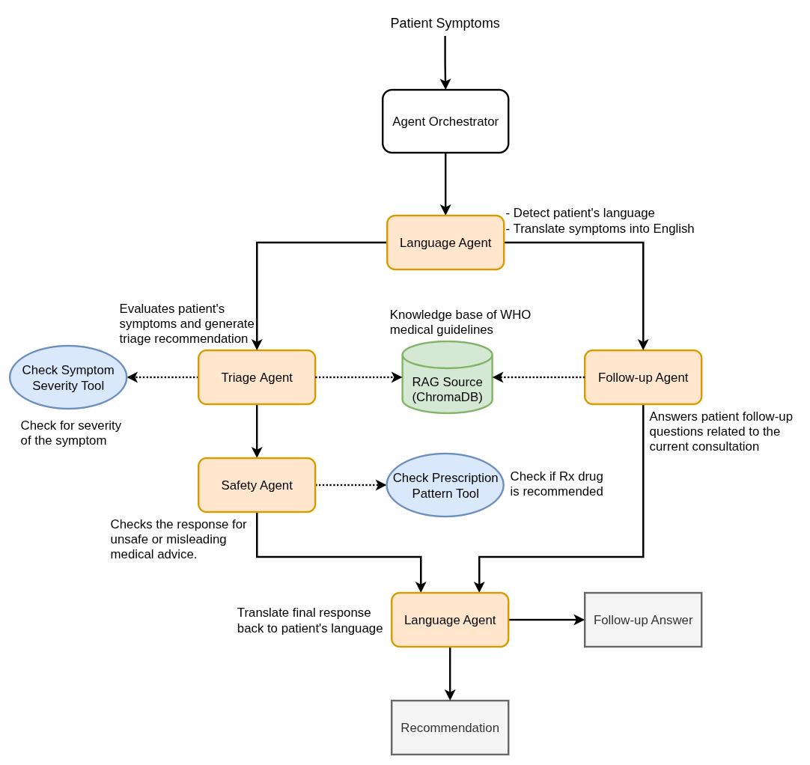

# MediGuideAI

## Overview

**AI-powered Medical Symptom Triage and Guidance Assistant for Rural Areas**

**MediGuideAI** is an AI-powered medical symptom triage designed for rural areas where access to medical facilities is limited. In a medical context, *triage* means determining how urgent a patient's condition is and what the appropriate next step should be. Example:

- **Symptoms**: Mild sore throat and runny nose for one day
- **Triage guidance**: Monitor symptoms at home, stay hydrated, and consult a doctor if symptoms worsen or persist.

The goal of the application is to assist patients in reporting their symptoms in their own language and provide structured and safe recommendation on the appropriate next steps. The system may suggest appropriate over-the-counter (OTC) medications for symptom relief but never recommends prescription (Rx) medication. It always advises patients to consult a healthcare professional.

---

## Agent Workflow



---

## Prerequisites

| Tool | Minimum version | Purpose |
|------|----------------|---------|
| Docker | 24+ | Run all services |
| Node.js | 18+ | Frontend development |
| Python | 3.11+ | Backend development |

---

## Environment Variables

Create a `.env` file in the project root before starting the services and update the values.

```dotenv
# ── LLM ──────────────────────────────────────────────────────────────────────
# Required for live LLM inference. Without this the heuristic fallback is used.
LLM_API_KEY=<YOUR_API_KEY_HERE>

# OpenAI-compatible base URL. Defaults to Groq; override to use any compatible provider.
# Examples:
#   Groq:      https://api.groq.com/openai/v1
#   OpenAI:    https://api.openai.com/v1
#   Ollama:    http://localhost:11434/v1
LLM_API_URL=https://api.groq.com/openai/v1

# Model name supported by the configured provider.
# Examples: llama-3.1-8b-instant  |  llama-3.3-70b-versatile
MODEL_NAME=llama-3.1-8b-instant

# ── Vector DB (Chroma) ────────────────────────────────────────────────────────
# Set automatically by docker-compose. Override when pointing to an external server.
CHROMA_SERVER_HOST=chroma
CHROMA_SERVER_HTTP_PORT=8000
CHROMA_COLLECTION_NAME=clinical_guidelines

# ── RAG ───────────────────────────────────────────────────────────────────────
RAG_TOP_K=3

# ── CORS ──────────────────────────────────────────────────────────────────────
# Comma-separated list of allowed origins. Defaults to wildcard (*) if omitted.
ALLOWED_ORIGINS=http://localhost:5173,http://localhost

# ── Localisation ─────────────────────────────────────────────────────────────
DEFAULT_LANGUAGE=en

# ── MySQL (User Accounts) ─────────────────────────────────────────────────────
# Set automatically by docker-compose. Override when using an external MySQL server.
MYSQL_HOST=mysql
MYSQL_PORT=3306
MYSQL_USER=<db_user>
MYSQL_PASSWORD=<password>
MYSQL_DATABASE=<db_name>
MYSQL_ROOT_PASSWORD=root
```

> **Security note:** Never commit your `.env` file. Add it to `.gitignore`.

---

## Quickstart Using Docker Compose 

1. Clone and enter the repository

```bash
git clone <repository-url>
cd MediGuideAI
```

2. Configure the environment

```bash
cp .env.example .env
```

3. Edit .env and set at minimum LLM_API_KEY and SECRET_KEY

4. Build and start all services

```bash
docker compose up --build
```

5. Access Frontend:  http://localhost:3000, Backend:   http://localhost:8001, API docs:  http://localhost:8001/docs

6. Stop and remove containers

```bash
docker compose down
```
---
